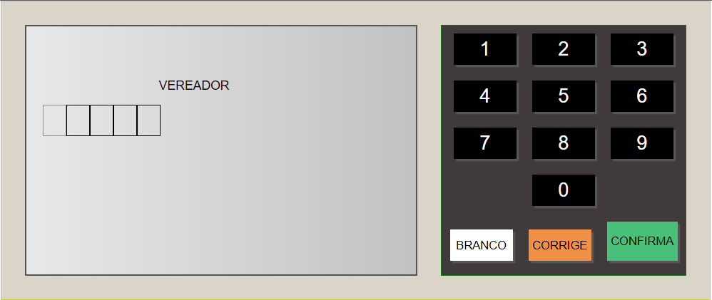
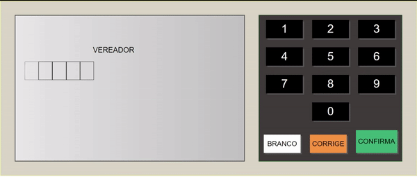

<p align="center">
  <a href="" rel="noopener">
  </a>
</p>

<h3 align="center">Urna Eletrônica</h3>

<div align="center">

[]()
[](https://github.com/rogeriopio/urna-eletronica/issues)
[](https://github.com/rogeriopio/urna-eletronica/pulls)
[](/LICENSE)

</div>

---

<p align="center">Aplicação que simula uma urna eletrônica 
    <br> 
</p>

## 📝Tabelas de Conteudo

-   [Sobre](#sobre)
-   [Inciando o Projeto](#iniciando-o-projeto)
-   [ Como este projeto funciona](#como-este-projeto-funciona)
-   [ Como utilizar este projeto?](#como-utilizar-este-projeto)
-   [Tecnologia Utilizada](#tecnologia-utilizada)
-   [Autor](#autor)

## 🧐 Sobre

### O que é este projeto

<p>Simples modelo de urna eletrônica ,feita em HTML,CSS e JS, criada para treinar logica e conceitos</p>

##### O que esse projeto faz?

Tem como objetivo de computar dados digitados pelo usuário ,sobre suas escolhas, de prefeitos e vereadores

## 🏁 Iniciando o projeto

Como instalar o projeto

### Pré-requisitos

Antes de começar você vai precisar ter instalado em sua maquina as seguintes ferramentas:

-   [VSCode](https://code.visualstudio.com/)
-   [Git](https://git-scm.com)
-   [Node.js](https://nodejs.org/en/)
-   [Extensão LiveServer VsCode](https://marketplace.visualstudio.com/items?itemName=ritwickdey.LiveServer)

```
# Clone este repositório
$ git clone https://github.com/rogeriopio/urna-eletronica.git

# Acesse a pasta do projeto no terminal/cmd
$ cd urna-eletronica

# Instale as dependências
$ npm install
```

## 🔧 Como este projeto funciona?

<p>Apenas digite os numeros dos veriadores e de prefeitos listados em etapas.js</p>
<p>No caso temos para vereador os numeros 38111 e 77222
ja para prefeito temos 99 e 84</p>

</a>

## 🎈 Como utilizar este projeto

Fique a vontade para clonar o projeto  
No arquivo etapas.js é possivel a adicionar mais Cargos apenas seguindo o modelo:

```
{
  titulo: 'XXXXX',
  numeros: x,
  candidatos: [
    {
      numero: '111',
      nome: 'XXXX',
      partido: 'XXXX',
      fotos: [{ url: '111.png', legenda: 'xxxx' }],
    }
  ]
}
```

P ara verificar como o projeto funciona ,teste pelo link [Urna Eletronica](https://rogeriopio.github.io/urna-eletronica/)

## Tecnologia Utilizada

As seguintes ferramentas foram usadas na construção do projeto:

-   [](https://developer.mozilla.org/pt-BR/docs/Web/JavaScript)
-   [](https://developer.mozilla.org/pt-BR/docs/Web/CSS)
-   [](https://developer.mozilla.org/pt-BR/docs/Web/HTML)

## ✍️ Autor

Feito por [@rogeriopio](https://github.com/rogeriopio/) 👋🏽 Entre em contato!

[](https://twitter.com/rogerioxpio) [](https://www.linkedin.com/in/rogerioxpio/)
[](mailto:rogerioxpio@gmail.com)
